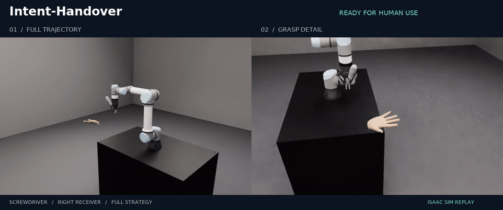
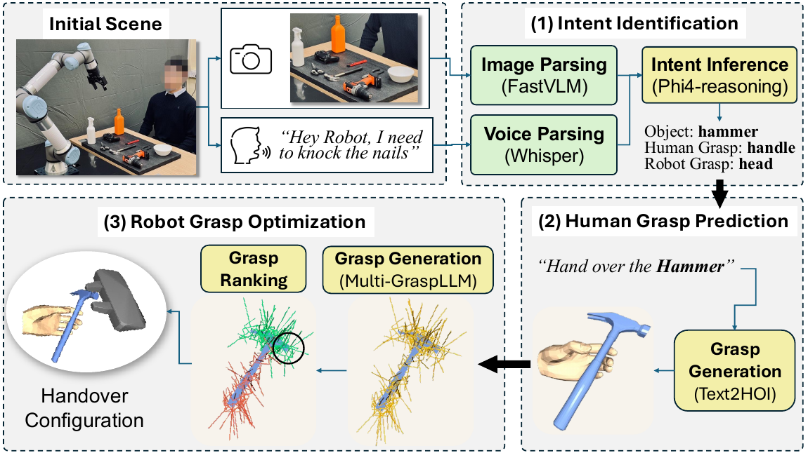

<div align="center">

# Intent-Handover

**Hand over objects ready for human use.**

Intent-aware grasp selection · Receiving-hand prediction · Ergonomic delivery

[**Paper**](https://robot-future.github.io/intent-handover/IntentHandover_arxiv.pdf) · [**Project**](https://robot-future.github.io/intent-handover/) · [**Quick start**](#quick-start) · [**Demos**](#demo-gallery) · [**R2HandoverSim**](https://github.com/Hanxin-Zhang/r2handoversim)

[](https://github.com/robot-future/intent-handover/raw/refs/heads/main/docs/media/intent-handover.mp4)

**One handover. Two perspectives.** Full Strategy with the original UR5e + Robotiq geometry in Isaac Sim.

[↓ Download the MP4](https://github.com/robot-future/intent-handover/raw/refs/heads/main/docs/media/intent-handover.mp4) · [Run the asset workflow →](docs/workflows.md#original-candidates-real-asset-pads-and-fixed-receivers)

</div>

## Demo gallery

### Objects, hands and viewpoints

[](https://github.com/robot-future/intent-handover/raw/refs/heads/main/docs/media/receiver-gallery.mp4)

Can and screwdriver · Left and right receivers · Fixed targets · A2 replay

[↓ Download the four-scene reel](https://github.com/robot-future/intent-handover/raw/refs/heads/main/docs/media/receiver-gallery.mp4) · [Set up receiving hands](https://github.com/Hanxin-Zhang/r2handoversim/blob/main/docs/fixed_receivers.md)

### Try grasp selection on your CPU

Generate local reports for hammer, screwdriver and bottle with one command:

```bash
intent-handover demo
```

[Hammer](docs/quickstart.md#2-open-the-demos) · [Screwdriver](docs/quickstart.md#2-open-the-demos) · [Bottle](docs/quickstart.md#2-open-the-demos) · [Compare all four strategies](docs/quickstart.md#3-compare-the-four-strategies)

## From intent to handover

**Keep the intended human grip available.** The paper connects intent grounding, receiving-hand prediction and robot grasp optimization, followed by ergonomic delivery.

[](https://robot-future.github.io/intent-handover/IntentHandover_arxiv.pdf)

*Paper overview · Fig. 2.* [Explore the method →](docs/paper_details.md)

| Identify | Predict | Select | Deliver |
| :--- | :--- | :--- | :--- |
| Structured object and usage intent | Text2HOI → MANO hand geometry | Usage filtering + avoidance ranking | Skeletal target → simulated replay |

## Quick start

**Python 3.10+ · CPU · NumPy.** The bundled demos run locally.

```bash
git clone https://github.com/robot-future/intent-handover.git
cd intent-handover
python -m venv .venv
source .venv/bin/activate
python -m pip install -e .
intent-handover demo
```

Open **`outputs/demo/hammer_FS.html`** in your browser. Screwdriver and bottle reports are generated alongside it.

On Windows, activate with `.venv\Scripts\activate`. You can also run commands as `python -m intent_handover`.

[Step-by-step guide →](docs/quickstart.md)

## Choose your workflow

| I want to… | Start here | You get |
| :--- | :--- | :--- |
| **Compare FS / A1 / A2 / A3** | `intent-handover ablate` | 12 reports + paired experiment manifest |
| **Use a language instruction** | [Structured intent](docs/workflows.md#structured-intent) | Catalog-aware prompt + validated intent JSON |
| **Predict a receiving hand** | [Neural pipeline](docs/neural_pipeline.md) | Text2HOI prediction + decoded MANO geometry |
| **Use my object data** | [Dataset and grasp import](docs/dataset.md) | Object scenes + annotated candidate proposals |
| **Replay original robot assets** | [Calibrated asset workflow](docs/workflows.md#original-candidates-real-asset-pads-and-fixed-receivers) | Fixed-receiver Isaac Sim replay + audits |
| **Build a custom scene** | [Scene contract](docs/schema.md) | Explicit geometry, regions and grasp frames |

## Built to inspect and extend

**55 CPU tests** · **6,827 imported grasp proposals** · **16 object inputs** · **4 paired strategies**

Selections, source hashes, receiver poses and resolved replay geometry travel together through the workflow. [Validation](docs/validation.md) · [Geometry contract](docs/geometry_audit.md) · [Media sources](docs/media/README.md)

<details>
<summary><strong>Cite this work</strong></summary>

```bibtex
@inproceedings{zhang2026intenthandover,
  title={Intent-Handover: Grounding Language in Human-Usage Regions for Trustworthy Robot-to-Human Handovers},
  author={Zhang, Hanxin and Dhafer, Abdulqader and Dong, Hongbiao and Hao, Zhou Daniel},
  booktitle={IEEE/RSJ International Conference on Intelligent Robots and Systems},
  year={2026}
}
```

</details>

Code: [MIT](LICENSE) · Dependencies and asset setup: [Third-party notices](THIRD_PARTY.md)

## Repository layout

The Python package lives in `src/intent_handover/`, with runnable examples in `examples/` and tests in `tests/`. The project showcase remains at `docs/index.html`; GitHub Pages publishes `docs/`.
